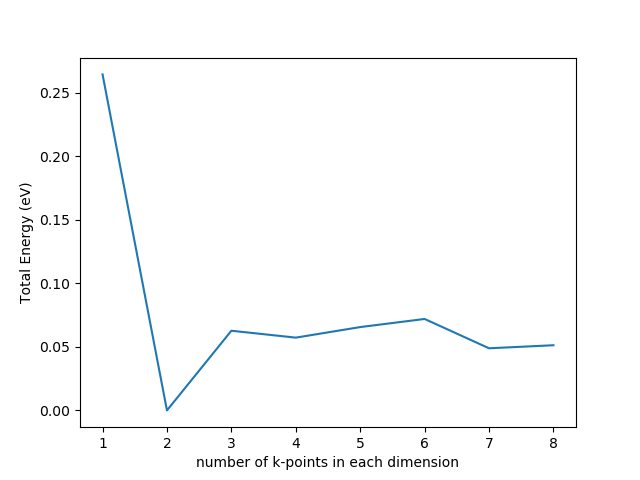

Bulk Calculations
=====

Overview
------------

Calculations of the bulk MgO and Pt/MgO models will be considered here

K-point convergence
------------

Vasp Parameters

INCAR created by Atomic Simulation Environment
 ENCUT = 300.000000
 POTIM = 0.500000
 SIGMA = 0.200000
 EDIFF = 1.00e-06
 EDIFFG = -5.00e-02
 ALGO = Fast
 GGA = RP
 PREC = Normal
 IBRION = 2
 ICHARG = 2
 ISIF = 2
 ISMEAR = 1
 ISPIN = 2
 ISTART = 1
 ISYM = 0
 LORBIT = 11
 NELMDL = -4
 NELMIN = 4
 NPAR = 4
 NSIM = 4
 NSW = 50
 NUPDOWN = -1
 NWRITE = 1
 VOSKOWN = 1
 IVDW = 0
 LAECHG = .FALSE.
 LASPH = .TRUE.
 LCHARG = .FALSE.
 LPLANE = .TRUE.
 LWAVE = .FALSE.
 LREAL = Auto

Functional Benchmarking
----------

