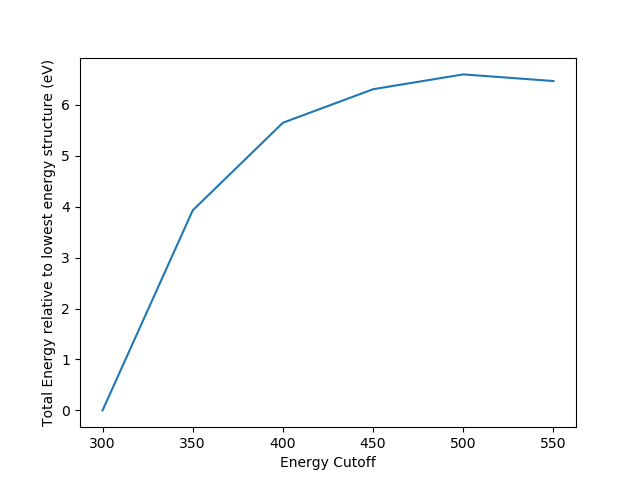

ENCUT convergence testing
==========

Overview
--------

"VASP manual recommends that you set PREC to 'high', and that ENCUT be set to 1.3*max(ENMAX) of the pseudopotentials. This is necessary to avoid problems caused by small basis sets when the volume changes, and Pulay stress. It is important to ensure that the energies are reasonably converged with respect to k-point grids. Hence, it can be a significant amount of work to do this right! Let us start with determining the ENCUT value that is appropriate for TiO2"

grep ENMAX Mg/POTCAR 
   ENMAX  =  200.000; ENMIN  =  100.000 eV
grep ENMAX O/POTCAR 
   ENMAX  =  400.000; ENMIN  =  300.000 eV

ENCUT = 1.3*400 = 520 eV

Encut Convergence
---------

Computational Cost Data
-------

opt_300_444/OUTCAR:                         Elapsed time (sec):     1290.629
opt_350_444/OUTCAR:                         Elapsed time (sec):    14677.112
opt_400_444/OUTCAR:                         Elapsed time (sec):    20174.887
opt_450_444/OUTCAR:                         Elapsed time (sec):    10391.935
opt_500_444/OUTCAR:                         Elapsed time (sec):     4593.733
opt_550_444/OUTCAR:                         Elapsed time (sec):     3637.514
