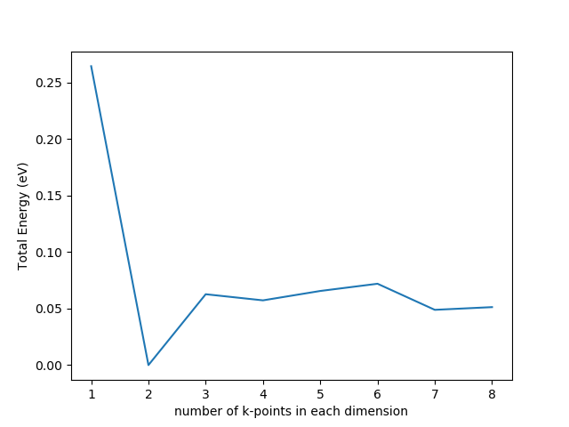

K-point convergence
=============

Overview
------------

K-point convergence testing was conducted to confirm the numerical convergence of DFT integrals using the Monkhorst-Pack k-point grid. These k-points specifiy a grid that is used to approximated integrals over the Brillouin zone (BZ) within the reciprocal space. 

Vasp Parameters
--------------

INCAR created by Atomic Simulation Environment
 ENCUT = 300.000000
 POTIM = 0.500000
 SIGMA = 0.200000
 EDIFF = 1.00e-06
 EDIFFG = -5.00e-02
 ALGO = Fast
 GGA = RP
 PREC = Normal
 IBRION = 2
 ICHARG = 2
 ISIF = 2
 ISMEAR = 1
 ISPIN = 2
 ISTART = 1
 ISYM = 0
 LORBIT = 11
 NELMDL = -4
 NELMIN = 4
 NPAR = 4
 NSIM = 4
 NSW = 50
 NUPDOWN = -1
 NWRITE = 1
 VOSKOWN = 1
 IVDW = 0
 LAECHG = .FALSE.
 LASPH = .TRUE.
 LCHARG = .FALSE.
 LPLANE = .TRUE.
 LWAVE = .FALSE.
 LREAL = Auto
 
 K-point convergence
 --------------

For the range of k-points tested (k:1 - 8; k x k x k), the energy appears to converge around k = 3. The values for the total energy oscillate around a value of 0.05 eV. This inidicates that increasing the number of k-points may not improve the numerical accuracy of the integration. A choice of k=4 will be used since the increase of k from 3 to 4 improves numerical convergence with about the same computational effort (due to symmetries, see sholl textbook).

The model tested has the following unit cell([8.424, 8.424, 30.317999999999998] ; [x,y,z]). The larger z-component of the cell is due to the inclusion of 12 agstrom of vacuum on either side of the slab model. The vacuum was included to avoid spurious interations between the periodic structures of the slab in the z-direction. The amount of vacuum and size of slab has not yet been decided. After deciding on the number of slab layers and the amount vacuum space needed to model our system, the number of k-points needed for numerical convergence will be reassessed. 

As a general rule of thumb, calculations with similiar densities of k-points in reciprocal space will have similar levels of convergence. In short, less k-points will required in the z-direction. For our current system, this would lead to a k-point grid of (4 x 4 x 1) because this would lead to similar densities of k-points in reciprocal space.
